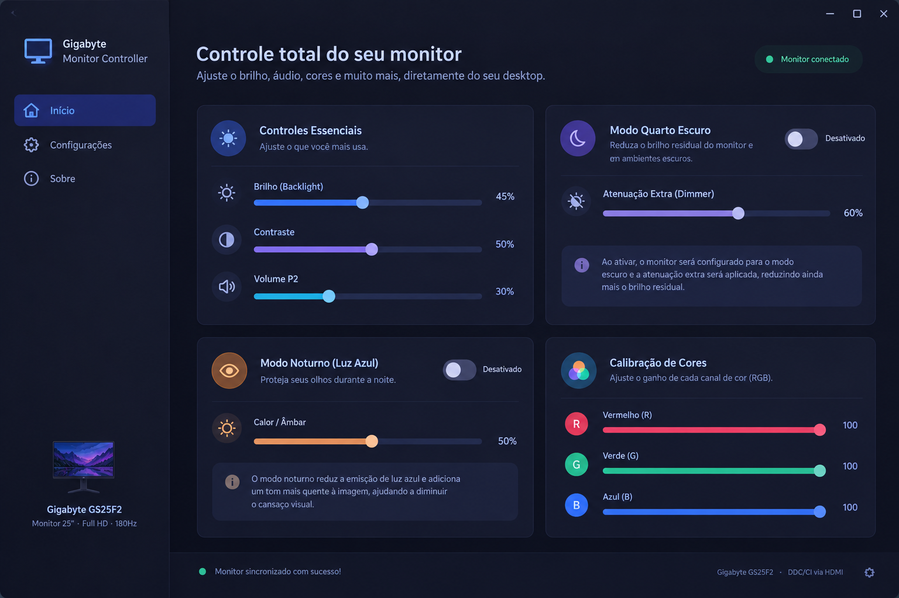

# Gigabyte Monitor Controller (Linux / Wayland)

Um painel desktop moderno construído com **GTK4 / Libadwaita** e **Python** para controle completo de hardware de monitores **Gigabyte** (focado no modelo **GS25F2**) e outros monitores compatíveis com o protocolo **DDC/CI** via barramento I2C (HDMI / DisplayPort).



---

## ✨ Recursos

- ☀️ **Controles Essenciais:**
  - Brilho Físico da Lâmpada (*Backlight*) (VCP `0x10`)
  - Contraste do Painel (VCP `0x12`)
  - Volume da saída de áudio analógica P2 traseira (VCP `0x62`)
- 🌑 **Modo Quarto Escuro (*Pitch-Black Room Mode*):**
  - Permite escurecer o monitor além do limite físico do brilho `0%`.
  - Reduz o ganho das matrizes de cristal líquido (LCD Gain) e contraste, atenuando ofuscamento em ambientes totalmente sem luz.
  - Guarda e restaura o brilho diurno anterior automaticamente ao desligar.
- 🌙 **Modo Noturno Hardware (*Anti-Blue Light*):**
  - Aplica o filtro de luz azul direto no hardware do monitor, operando mesmo em ambientes Wayland onde o night-light nativo do SO costuma falhar em telas HDMI secundárias.
  - Slider de Calor / Âmbar para regular o corte de luz azul.
- 🎨 **Calibração Fina de Cores (RGB Gain):**
  - Ajuste individual dos canais Vermelho (R), Verde (G) e Azul (B).
  - Destravamento automático do perfil de fábrica para modo *User* (`0x0b`).
- ⚡ **Proteção de Hardware e Performance:**
  - *Debounce* assíncrono para prevenir desgaste excessivo de escrita na memória EEPROM/NVRAM do monitor.
  - Sincronização bidirecional em tempo real ao abrir o app.

---

## 🛠️ Requisitos e Instalação

### 1. Dependências do Sistema (Fedora / RHEL):
```bash
sudo dnf install ddcutil python3-gobject gtk4 libadwaita -y
```

### 2. Permissões de Hardware (udev):
Para permitir que o seu usuário controle o monitor sem precisar de `sudo`:
```bash
echo 'KERNEL=="i2c-[0-9]*", MODE="0666"' | sudo tee /etc/udev/rules.d/99-i2c.rules
sudo udevadm control --reload-rules && sudo udevadm trigger
```

---

## 🚀 Executando

Clone o repositório e execute:
```bash
cd gigabyte-monitor-controller
python3 main.py
```

### Versão Legada (Tkinter):
A versão anterior construída em Tkinter foi preservada para fins de compatibilidade e testes rápidos:
```bash
python3 legacy_tk_app.py
```

---

## 📄 Licença
Distribuído sob a licença MIT.
